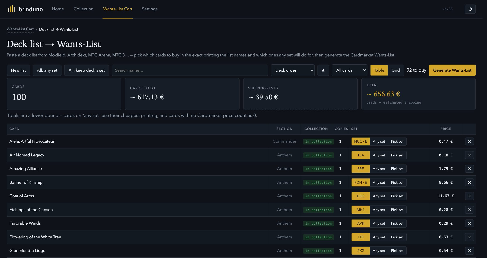
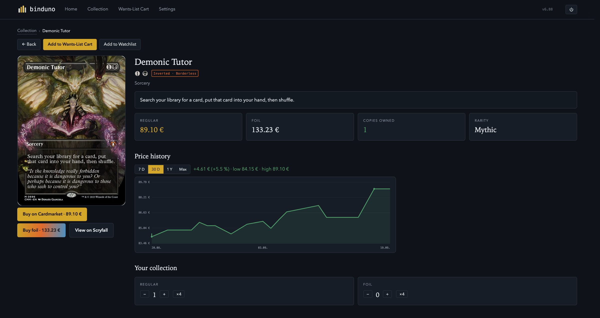
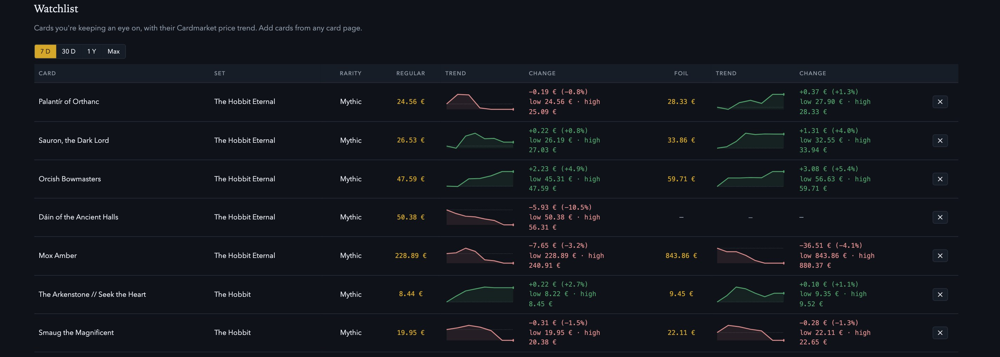
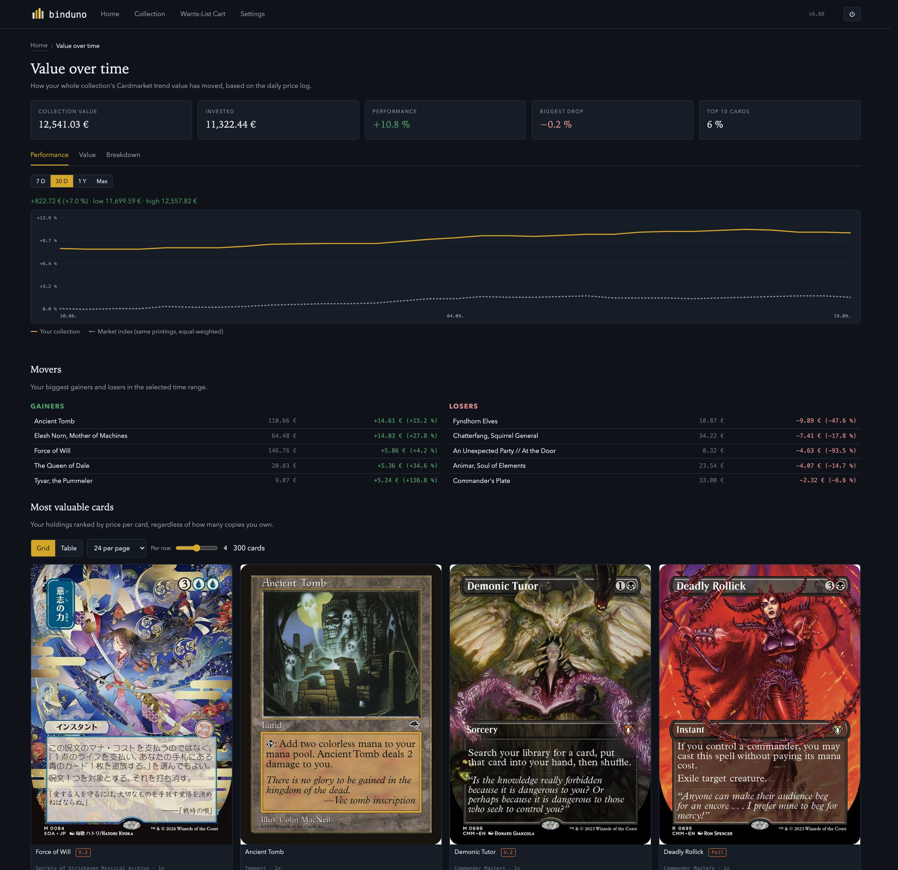
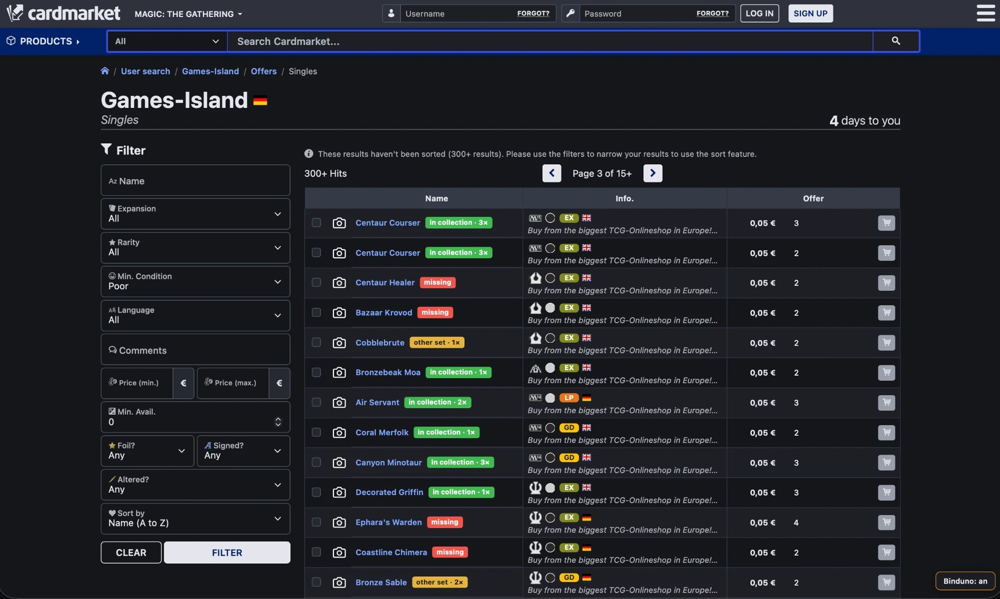

<div align="center">


# Binduno

**A local Magic: The Gathering collection tracker and Cardmarket Wants‑List builder.**

One Python file, standard library only. No account, no cloud, nothing to sign up for — your collection never leaves your computer.


</div>

---

## Contents

- [What it is](#what-it-is)
- [Features](#features)
  - [The collection dashboard](#the-collection-dashboard)
  - [Set completion, your rules](#set-completion-your-rules)
  - [Wants-Lists for Cardmarket](#wants-lists-for-cardmarket)
  - [Easily build your dream deck](#easily-build-your-dream-deck)
  - [Price history and watchlist](#price-history-and-watchlist)
  - [Value over time](#value-over-time)
  - [The Cardmarket browser helper](#the-cardmarket-browser-helper)
  - [Everything else](#everything-else)
- [Install](#install)
  - [Windows: download, no Python needed](#windows-download-no-python-needed)
  - [Run from source (any OS)](#run-from-source-any-os)
  - [macOS: double-clickable app](#macos-double-clickable-app)
  - [Build the Windows .exe yourself](#build-the-windows-exe-yourself)
- [Updating](#updating)
- [How it works](#how-it-works)
- [Testers welcome](#testers-welcome)
- [License](#license)
- [Disclaimer](#disclaimer)

---

## What it is

Binduno reads a CSV export of your collection (from **ManaBox**, **Moxfield** or **Archidekt**), pulls card and price data from **Scryfall**, and shows you exactly where your collection stands — per set, per rarity, by card name vs. by printing — and what it would take to fill the gaps. When you want to buy, it turns that into ready‑to‑paste **Cardmarket Wants‑Lists** with the correct naming, bracket order and 150‑entry chunking.

It runs a tiny local web server and opens in your browser. That's the whole app.

<p align="center"></p>

---

## Features

### The collection dashboard

- Two goals side by side: **card names** ("one of everything") and **printings** (full set completion) — the same collection reads very differently under the two rules
- Per‑set progress, cost to finish, closest‑to‑done and cheapest‑to‑close lists
- Breakdown by rarity, switchable between name‑count and printing‑count
- Collection value at Cardmarket trend prices

### Set completion, your rules

- Choose what counts as 100 %: one printing per name, every collector number, or include Showcase / borderless / extended‑art / special foils
- Three built‑in **collector profiles** (Name / Base Set / Master Set Collector) get you close in one click; every rule underneath is still yours to flip
- Serialized cards and whole sets (promos, tokens, Un‑sets…) toggleable
- Optional price cap that sets very expensive cards aside so one Reserved‑List card doesn't make a set look unaffordable *(off by default)*

<table>
<tr>
<td width="50%"></td>
<td width="50%"></td>
</tr>
</table>

### Wants-Lists for Cardmarket

- Correct Cardmarket names, bracket order (`Card (Set) (V.1)` vs. `Card (V.1) (Set: Extras)`), quantity prefixes and 150‑entry blocks
- "Buy missing" per set, or collect cards across sets in the **Wants‑List Cart**
- Multi‑select in the card browser to add several cards to the cart at once
- **Secret Lair** works too — Cardmarket splits it into dozens of per‑drop expansions, so Binduno resolves each Secret Lair card to its exact drop ("Secret Lair Drop Series: Marvel Superdrop", …) via Cardmarket's public product list and emits the matching want‑list line.

### Easily build your dream deck

Paste a deck list from **Moxfield, Archidekt, MTG Arena, MTGO, TappedOut, Deckstats** or plain text and Binduno turns it into a Wants‑List:

- Every line is matched against the card data; free‑form Archidekt category headers ("Ramp", "Burn", "Land"…) are recognised as sections, not treated as unknown cards
- A green / yellow / red **collection badge** on every row, exactly like the browser helper — own it in the set you'd buy from, own another printing, or missing
- Per card, decide whether to buy the **exact printing the list names** or let **any set** do (any‑set → the line is generated without a set, priced from the cheapest printing); a searchable set picker shows every printing with its image and price
- A running **price + shipping estimate** for the whole list, sortable columns, table or grid view
- The Wants‑List Cart is never touched — you just get the text blocks

<p align="center"></p>

### Price history and watchlist

- A **price history graph on every card page** — 7 days, 30 days, 1 year or Max, with a crosshair that reads off the exact date and price
- A **watchlist** of up to 100 cards on the home page, with regular and foil price trend + change shown side by side, and the same time‑range switch
- **Purchase prices**, tracked per batch — buy the same card twice at different prices and Binduno keeps both, instead of blending them into one number

<p align="center"></p>
<p align="center"></p>

> Right after a fresh install the history reaches back further than 90 days if the project's own price server is reachable (it's been logging daily since it went up), or about 90 days from MTGJSON's public price file otherwise. Binduno then logs prices itself every day it runs, so the history fills in on its own — after a year, *1 Y* really is a year.

### Value over time

- A **performance graph** of your whole collection's Cardmarket trend value, not just today's snapshot — your collection vs. an equal‑weighted market index of the same printings, so you can tell price movement from "I bought more stuff"
- **Movers**: your biggest gainers and losers in the selected time range, by the card's own price
- **Most valuable cards**, ranked by price per card regardless of how many copies you own — grid or table view, same sorting and paging as everywhere else

<p align="center"></p>

### The Cardmarket browser helper

*Optional userscript / bookmarklet.*

- Marks every single offer on cardmarket.com by whether you already own the card — **green** (this exact printing), **yellow** (you own it in another set / version / finish), **red** (missing), with the copy count — handy for topping up a seller's order with cheap missing cards at no extra shipping
- Marks every entry on your Cardmarket **Wants‑Lists** the same way, so you can spot wants you've since bought and clean them up
- On a purchase's order page, one button adds every card from that order straight into your Binduno collection

<p align="center"></p>

*A seller's singles list on cardmarket.com with the helper running: every offer is tagged **in collection** (green — you already have this exact printing, with the copy count), **other set** (yellow — you own the card, just a different printing) or **missing** (red), and gets a matching colour bar down its left edge.*

### Everything else

- **Import:** ManaBox, Moxfield and Archidekt CSV exports, auto‑detected; replace or add
- Works offline apart from card images and set icons
- Import format detection, plain‑language errors
- Daily automatic card / price sync
- Automatic backups of your hand‑built data before any destructive step (update, replace‑import, reset)
- German and English UI; German card names supported
- Dark, light and colour‑blind‑friendly themes
- Menu‑bar / system‑tray icon on the packaged builds (Open · Quit)
- Open it on your phone over Wi‑Fi (there's a QR code in Settings)

<p align="center"></p>

---

## Install

### Windows: download, no Python needed

Download **`Binduno.exe`** from the [latest release](../../releases/latest) and double‑click it. One self‑contained file — no Python, no setup. Your collection is stored in `%LOCALAPPDATA%\Binduno` and kept between runs.

> The .exe isn't code‑signed, so Windows SmartScreen shows a blue box on first run: click **More info → Run anyway**. Once only.

### Run from source (any OS)

You need **Python 3.9 or newer** — macOS and most Linux ship with it; on Windows install it from [python.org](https://www.python.org/downloads/) with *"Add python.exe to PATH"* ticked.

```bash
python3 binduno.py
```

It opens `http://127.0.0.1:8770` in your browser. Data is kept in your user folder between runs.

### macOS: double-clickable app

```bash
python3 binduno.py --install-app
```

Builds `~/Applications/Binduno.app` with its own bundled Python runtime — after that you never need the Terminal again. A menu‑bar icon (Open · Quit) shows while it runs.

> The app isn't notarized by Apple, so macOS blocks the first launch (*"Apple could not verify… free of malware"*). To allow it, once:
> - **macOS 15 Sequoia and newer:** open **System Settings → Privacy & Security**, scroll to the bottom, click **Open Anyway** next to the Binduno message, confirm with Touch ID or your password.
> - **macOS 14 and earlier:** right‑click the app → **Open**, then **Open** in the dialog.
>
> It launches normally afterwards. Building the app on the same Mac usually skips the prompt entirely — it mainly shows up when the `.app` was copied from another machine.

### Build the Windows .exe yourself

Only needed to build from modified source or for another architecture. On a Windows machine with Python:

```bash
py -m pip install --upgrade pyinstaller
py binduno.py --build-exe
```

Produces `dist\Binduno.exe`.

---

## Updating

Open **Settings → Update & Help → Update App → "Update from GitHub"** and click **Check for updates**.

- **Running from source (macOS, Linux, Windows‑from‑source):** Binduno downloads the newest `binduno.py`, checks it, backs up the old one (`binduno_previous.py`) and restarts itself. It checks both the latest Release *and* the `main` branch and takes whichever is newer, so a plain source fix doesn't have to wait for a Release.
- **The packaged `Binduno.exe`:** downloads the newest `Binduno.exe` from the latest GitHub Release, backs up the old one (`binduno_previous.exe`) and swaps itself in on restart. This only works once a Release with a built `Binduno.exe` exists — a bare `main`‑branch fix isn't installable this way, since there's no compiled binary for it yet; Binduno tells you so if you check for updates in between.

No re‑download, no reinstall either way.

---

## How it works

- **One file.** `binduno.py`, Python 3.9+, standard library only. The web UI lives in the same file.
- **Local storage.** A SQLite database in your user application‑data folder.
- **Card data.** Scryfall's public bulk export (`all_cards`) plus set metadata. Prices are Cardmarket's EUR trend figures, via Scryfall; deeper price history is backfilled once, from the project's own price server if it's reachable (it logs daily and so builds up more than 90 days over time) or from MTGJSON otherwise. Card refresh also pulls Cardmarket's public product list once to map Secret Lair cards to their exact drop.
- **Nothing leaves your machine** except the card‑data download from Scryfall, that one‑time price backfill request, and, if you use the browser helper, the pages you already opened on Cardmarket.

---

## Testers welcome

Binduno works and is used daily, but it's an early public release. If you try it:

- **Bugs, rough edges, confusing wording** — please open an [issue](../../issues).
- **Feature ideas that fit the concept** — issues too, or start a discussion.
- Especially useful: reports from **Windows**, from **large collections**, and from the **Cardmarket helper** on different browsers.

---

## License

Released under the **[PolyForm Noncommercial License 1.0.0](LICENSE)**. In short: you may use, study, modify and share Binduno freely for any **non‑commercial** purpose. Selling it, putting it behind a paywall, bundling it into a paid product or otherwise using it commercially — with or without changes — is **not** permitted.

## Disclaimer

This is an unofficial fan‑made project and is not affiliated with, endorsed, sponsored, or approved by Wizards of the Coast. Magic: The Gathering, all card names, images and related assets are trademarks and/or copyrights of Wizards of the Coast LLC and Hasbro, Inc. All prices are sourced from Scryfall and Cardmarket and shown for personal, non‑commercial reference only.
