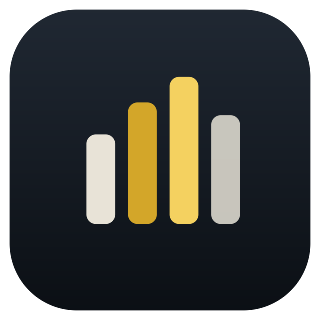
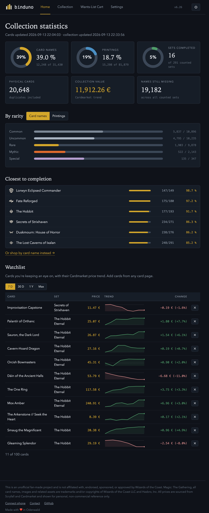
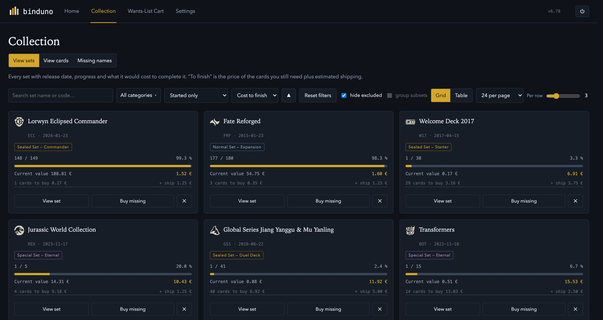
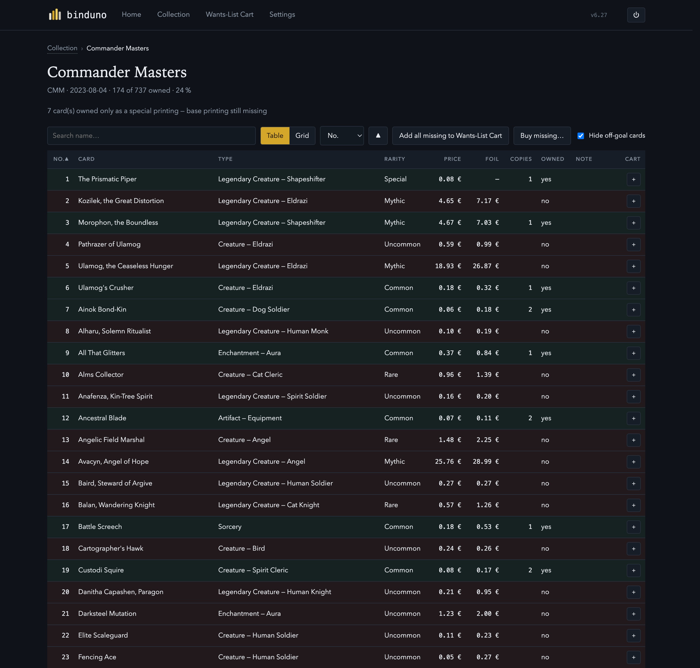
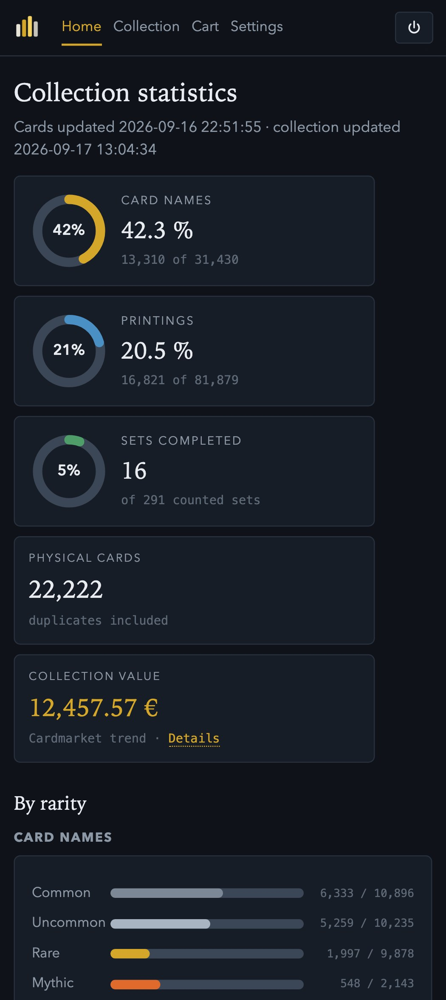

<div align="center">



# Binduno

**A local Magic: The Gathering collection tracker and Cardmarket want‑list builder.**

One Python file, standard library only. No account, no cloud, nothing to sign up for — your collection never leaves your computer.


</div>

---

## What it is

Binduno reads a CSV export of your collection (from **ManaBox**, **Moxfield** or **Archidekt**), pulls card and price data from **Scryfall**, and shows you exactly where your collection stands — per set, per rarity, by card name vs. by printing — and what it would take to fill the gaps. When you want to buy, it generates ready‑to‑paste **Cardmarket want lists** with the correct naming, bracket order and 150‑entry chunking.

It runs a tiny local web server and opens in your browser. That's the whole app.

<p align="center"></p>

---

## Features

**Collection overview**
- Two goals side by side: **card names** ("one of everything") and **printings** (full set completion)
- Per‑set progress, cost to finish, closest‑to‑done and cheapest‑to‑close lists
- Breakdown by rarity, switchable between name‑count and printing‑count
- Collection value at Cardmarket trend prices

**Set completion, your rules**
- Choose what counts as 100 %: one printing per name, every collector number, or include Showcase / borderless / extended‑art / special foils
- Serialized cards and whole sets (promos, tokens, Un‑sets…) toggleable
- Optional price cap that sets very expensive cards aside so one Reserved‑List card doesn't make a set look unaffordable *(off by default)*

<table>
<tr>
<td width="50%"></td>
<td width="50%"></td>
</tr>
</table>

**Cardmarket want lists**
- Correct Cardmarket names, bracket order (`Card (Set) (V.1)` vs. `Card (V.1) (Set: Extras)`), quantity prefixes and 150‑entry blocks
- "Buy missing" per set, or collect cards across sets in the Wantlist‑Cart
- *Secret Lair cards can't go in the Wantlist‑Cart yet* — Cardmarket splits Secret Lair into hundreds of separate expansions with no reliable mapping, so a generated line wouldn't match. Buy those directly from the card's Cardmarket page.

**Cardmarket browser helper** *(optional)*
- A userscript that marks every single offer on cardmarket.com by whether you already own the card — green (this exact printing), yellow (you own it in another set/version/finish), red (missing), with the copy count
- Handy for topping up a seller's order with cheap missing cards at no extra shipping

**Price watchlist**
- Up to 100 cards with a 7‑day Cardmarket price trend on the home page

**Import**
- ManaBox, Moxfield and Archidekt CSV exports, auto‑detected; replace or add

**Built for real use**
- Works offline apart from card images and set icons
- Import format detection, plain‑language errors
- Daily automatic card/price sync
- German and English UI; German card names supported
- Dark, light and colour‑blind‑friendly themes
- Menu‑bar / system‑tray icon on the packaged builds (Open · Quit)
- Open it on your phone over Wi‑Fi (there's a QR code in Settings)

<p align="center"></p>

---

## Install

### Windows — download, no Python needed

Download **`Binduno.exe`** from the [latest release](../../releases/latest) and double‑click it. One self‑contained file — no Python, no setup. Your collection is stored in `%LOCALAPPDATA%\Binduno` and kept between runs.

> The .exe isn't code‑signed, so Windows SmartScreen shows a blue box on first run: click **More info → Run anyway**. Once only.

### Run from source (any OS)

You need **Python 3.9 or newer** — macOS and most Linux ship with it; on Windows install it from [python.org](https://www.python.org/downloads/) with *"Add python.exe to PATH"* ticked.

```bash
python3 binduno.py
```

It opens `http://127.0.0.1:8770` in your browser. Data is kept in your user folder between runs.

### macOS — double‑clickable app

```bash
python3 binduno.py --install-app
```

Builds `~/Applications/Binduno.app` with its own bundled Python runtime — after that you never need the Terminal again. A menu‑bar icon (Open · Quit) shows while it runs.

> The app isn't notarized by Apple, so macOS blocks the first launch (*"Apple could not verify… free of malware"*). To allow it, once:
> - **macOS 15 Sequoia and newer:** open **System Settings → Privacy & Security**, scroll to the bottom, click **Open Anyway** next to the Binduno message, confirm with Touch ID or your password.
> - **macOS 14 and earlier:** right‑click the app → **Open**, then **Open** in the dialog.
>
> It launches normally afterwards. Building the app on the same Mac usually skips the prompt entirely — it mainly shows up when the `.app` was copied from another machine.

### Windows — build the .exe yourself

Only needed to build from modified source or for another architecture. On a Windows machine with Python:

```bash
py -m pip install --upgrade pyinstaller
py binduno.py --build-exe
```

Produces `dist\Binduno.exe`.

---

## Updating

Open **Settings → Update & Help → Update App → "Update from GitHub"** and click **Check for updates**. Binduno downloads the newest `binduno.py` from this repository, checks it, backs up the old one and restarts itself. No re‑download, no reinstall.

---

## How it works

- **One file.** `binduno.py`, Python 3.9+, standard library only. The web UI lives in the same file.
- **Local storage.** A SQLite database in your user application‑data folder.
- **Card data.** Scryfall's public bulk export (`default_cards`) plus set metadata. Prices are Cardmarket's EUR trend figures, via Scryfall.
- **Nothing leaves your machine** except the card‑data download from Scryfall and, if you use the browser helper, the pages you already opened on Cardmarket.

---

## This is an early version — testers welcome

Binduno works and is used daily, but it's a first public release. If you try it:

- **Bugs, rough edges, confusing wording** — please open an [issue](../../issues).
- **Feature ideas that fit the concept** — issues too, or start a discussion.
- Especially useful: reports from **Windows**, from **large collections**, and from the **Cardmarket helper** on different browsers.

---

## License

Released under the **[PolyForm Noncommercial License 1.0.0](LICENSE)**. In short: you may use, study, modify and share Binduno freely for any **non‑commercial** purpose. Selling it, putting it behind a paywall, bundling it into a paid product or otherwise using it commercially — with or without changes — is **not** permitted.

## Disclaimer

This is an unofficial fan‑made project and is not affiliated with, endorsed, sponsored, or approved by Wizards of the Coast. Magic: The Gathering, all card names, images and related assets are trademarks and/or copyrights of Wizards of the Coast LLC and Hasbro, Inc. All prices are sourced from Scryfall and Cardmarket and shown for personal, non‑commercial reference only.
